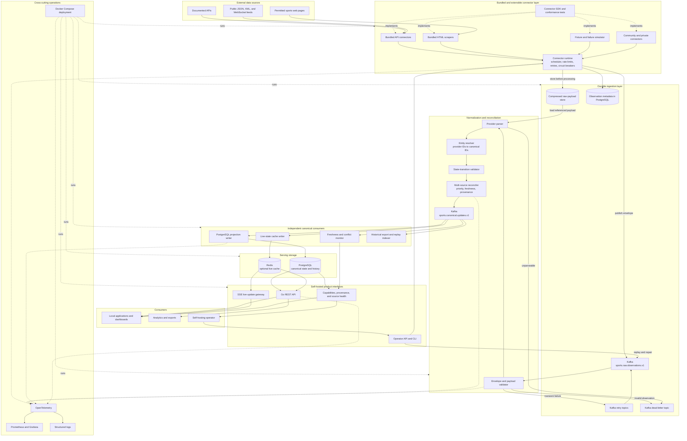
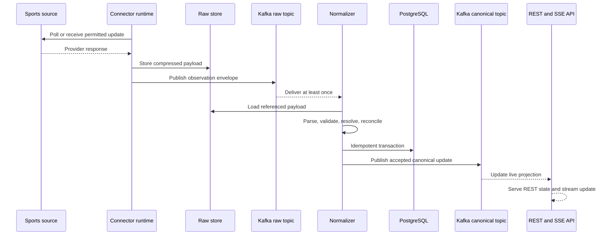

# Sports Data Platform — Architecture and Implementation Design

- Status: Proposed
- Last reviewed: 2026-07-17
- Intended reader: A developer learning backend engineering and distributed systems
- Initial sport: NBA basketball
- Primary language: Go
- Initial runtime: Self-hosted Docker Compose

## 1. Executive summary

This project will be a self-hosted sports-data ingestion and delivery platform written primarily in Go. Pluggable connectors collect observations from APIs, feeds, or permitted web pages. The platform preserves the original payload, publishes versioned observations through Kafka, normalizes provider-specific records into a canonical model, and serves current state through a Go REST API.

The long-term product goal is to provide an out-of-the-box, self-hosted alternative to paid sports APIs: one consistent API, a maintained pack of prebuilt collectors, many sports and sources, live updates when the bundled sources provide them, historical storage, provenance, and operational tooling. Users should receive useful data after installation without having to write a connector. They may also enable credentialed sources and create community or private connectors through the SDK.

The project does not claim ownership of third-party data or guarantee that every commercial dataset can be acquired for free. Every bundled connector must have a documented source-access review, conservative defaults, attribution where required, and an immediate disable switch. A source that cannot be responsibly bundled is not part of the default pack.

The first executable milestone deliberately supports one provider and a small NBA data model. The first public release must ship the bundled source pack described below. Kafka is not part of the first executable milestone; it is added when there are multiple downstream consumers and a demonstrated need for replay and failure isolation. This sequencing makes the architecture teachable and prevents Kafka from becoming decorative complexity.

The recommended starting source is **BALLDONTLIE's free NBA API**, using its teams and games endpoints. Its official documentation currently lists teams, players, and games on the free tier, with a free limit of five requests per minute. Live box scores are not included in that tier, so the first milestone should ingest schedules and completed/in-progress game records rather than claim production-grade live coverage. The source lives behind a connector interface so it can later be supplemented or replaced.

## 2. Goals and non-goals

### Goals

- Run the complete development environment locally.
- Support API, feed, fixture, and permitted scraper connectors through one contract.
- Preserve source observations for debugging, audit, and replay.
- Normalize provider-specific identifiers and fields into a stable schema.
- Make duplicate delivery safe through idempotent consumers and database constraints.
- Detect stale, malformed, and contradictory data.
- Serve current games through a versioned REST API.
- Demonstrate Kafka replay, downstream outage recovery, and independent consumers.
- Provide enough observability to explain failures rather than merely log exceptions.
- Ship a maintained starter pack of prebuilt collectors that provides useful data immediately after installation.
- Offer a documented connector SDK so the community can add sources without modifying the core.
- Report coverage, freshness, and provenance so API consumers know what the local installation can actually provide.
- Provide stable canonical API contracts that remain independent of enabled providers.
- Make installation and upgrades practical for a single self-hosting operator.

### Non-goals for version 1

- Every sport or major website.
- Betting, fantasy recommendations, or gambling functionality.
- Sub-second commercial live-data guarantees.
- Bypassing access controls, CAPTCHAs, authentication, or source restrictions.
- Kubernetes before the Docker Compose version is reliable.
- Exactly-once behavior across Kafka and PostgreSQL.
- A microservice for every entity.
- Bundling credentials, circumventing paid access, or redistributing data without permission.
- Claiming universal coverage when the operator has not enabled sources that provide it.

These exclusions are intentional. A reliable two-source NBA pipeline is a stronger portfolio artifact than many unsupported connectors.

## 2.1 Product boundary

The platform consists of six open-source products delivered together:

1. **Bundled source pack** — maintained API, feed, and permitted scraper connectors that make a fresh installation useful.
2. **Connector runtime and SDK** — scheduling, authentication hooks, rate limits, raw capture, health, and a versioned connector contract.
3. **Canonical sports model** — stable entities and sport-specific extensions.
4. **Streaming and reconciliation engine** — validation, identity resolution, conflicts, provenance, and replay.
5. **Self-hosted Sports API** — consistent REST and streaming contracts regardless of source.
6. **Operator experience** — Compose installation, migrations, dashboards, source configuration, backups, and upgrades.

Bundled and third-party connectors use the same installable capability model. Each publishes a machine-readable manifest:

```yaml
id: balldontlie-nba
version: 1.0.0
sports: [basketball]
leagues: [NBA]
capabilities: [teams, players, games]
freshnessClass: scheduled-polling
authentication: api-key
licenseReviewRequired: true
```

The API exposes an installation capability document so clients can distinguish `supported by the platform` from `available from this installation`:

```text
GET /api/v1/capabilities
GET /api/v1/sources
GET /api/v1/sources/{sourceId}/health
```

This prevents an empty or stale endpoint from masquerading as complete coverage.

## 2.2 Bundled source-pack requirements

A source pack is part of the product, not sample code. Every bundled connector must include:

- A source-access and attribution note
- Conservative, configurable polling defaults
- An explicit user agent and contact/project URL where appropriate
- Rate limiting, timeouts, bounded retries, and circuit breaking
- Raw-payload capture with secret redaction
- Offline parser fixtures for scheduled, live, final, postponed, and malformed records
- Schema-drift and zero-result detection
- Freshness and last-success metrics
- A kill switch that does not require rebuilding the application
- A maintainer and connector lifecycle status: experimental, stable, degraded, or retired
- Conformance tests against the connector SDK

The initial distribution target is:

1. `fixtures` — deterministic simulator and demo data, always enabled in demo mode.
2. `balldontlie-nba` — prebuilt API connector for NBA teams and games; users supply a free API key.
3. One genuinely permission-compatible public feed or HTML source — selected only after documenting its access and usage conditions; this proves the scraper path without making the release depend on questionable access.

The out-of-box experience may ask for optional credentials during setup, but it must not ask users to implement code. A demo profile must work without external credentials, and the standard profile should begin collecting as soon as its documented source configuration is present.

## 3. Source recommendation

### Primary learning source: BALLDONTLIE NBA

Use these free-tier resources first:

- `GET https://api.balldontlie.io/v1/teams`
- `GET https://api.balldontlie.io/v1/games` with date or season filters

Why this source:

- It has official documentation and an OpenAPI specification.
- Teams and games are available on the free tier.
- Authentication and pagination are realistic integration concerns.
- Five requests per minute forces correct rate-limit and scheduling behavior without requiring high traffic.
- The provider contains its own IDs and response schema, making normalization meaningful.

Limitations:

- Free access does not include live box scores, player game statistics, or standings.
- It cannot by itself prove multi-source reconciliation.
- Provider availability, pricing, and tier contents may change; they are configuration assumptions, not domain rules.

The API key must come from an environment variable or local secrets store. It must never be committed.

### Secondary source

Add TheSportsDB only after the first connector works. Its free v1 API is intentionally beginner-friendly and covers many sports, while its modern v2 and two-minute live-score features currently require premium access. It is useful for learning provider mapping because its naming and identifiers differ from BALLDONTLIE.

Before implementing any HTML connector, verify that collection and the intended use of the resulting data are allowed. A connector must not bypass technical access controls.

The current NBA source review and bundling decisions are maintained in [the NBA source policy review](../sources/nba-source-policy.md).

### Test source

Build a local `FixtureConnector` before using live data. It reads stored JSON and can simulate duplicates, missing fields, timeouts, rate limits, provider corrections, and out-of-order observations. This makes the reliability behavior deterministic and demoable.

## 4. Final logical architecture



The diagram separates six important boundaries:

1. **Sources** are external and assumed unreliable.
2. **Connectors** understand source-specific access and formats but not canonical persistence.
3. **Kafka** is the durable hand-off and replay log, not the website listener.
4. **Processing** validates, resolves identities, and selects canonical state.
5. **Projections** build queryable views independently from the retained stream.
6. **Delivery and operations** form the actual self-hosted product consumed and operated by users.

Kafka is an internal boundary. It does not poll external sources. Connectors poll or subscribe to those sources and publish what they observed.

### Observation lifecycle



The raw response is stored before downstream interpretation. If parsing or reconciliation code is repaired later, retained observations can be replayed without requesting the source again.

## 5. Deployment evolution

### Stage A: modular monolith

```text
BALLDONTLIE -> Connector module -> Normalizer -> PostgreSQL -> REST API
```

One Go module contains an API command and connector command sharing internal application packages. The connector initially calls application services directly. This stage teaches HTTP, explicit dependency construction, database modeling, migrations, validation, cancellation, and idempotency.

### Stage B: event-driven local platform

```text
Connector worker -> Kafka -> ingestion worker -> PostgreSQL -> API
```

Kafka is introduced after Stage A tests pass. Raw observations become the durable hand-off. Stopping PostgreSQL or the ingestion worker must not require the connector to understand database recovery.

### Stage C: multi-source platform

```text
Multiple connectors -> Kafka -> normalization -> reconciliation -> projections
```

A second provider introduces entity mapping, data provenance, freshness policies, and conflicts. Redis and WebSocket/SSE delivery are added only when live state exists.

### Stage D: production-style operation

Split deployment units only where independent scaling or failure isolation is demonstrated. Add dashboards, tracing, alert rules, load tests, and optional Kubernetes manifests. Docker Compose remains the supported local path.

## 6. Technology decisions

### Go

Use the current stable Go release supported by the project's CI. Go fits concurrent connector workers, Kafka consumers, small self-hosted containers, and infrastructure-oriented backend development. Goroutines provide lightweight concurrency, while `context.Context` carries cancellation and deadlines through HTTP, Kafka, storage, and shutdown paths. Dependencies are constructed explicitly in `cmd/*/main.go`; no dependency-injection framework is required.

Use the standard library wherever it is sufficient. A small router such as `chi` is acceptable for route composition and middleware, but the domain and application layers must not depend on it.

### PostgreSQL

PostgreSQL is the system of record for canonical entities and query projections. Relational constraints make identity, uniqueness, and valid relationships explicit. JSON columns may retain provider metadata, but canonical fields should remain typed columns.

### pgx, sqlc, and goose

Use `pgx` as the PostgreSQL driver, `sqlc` to generate type-safe Go methods from reviewed SQL, and `goose` for schema migrations. Explicit SQL makes indexes, transactions, locking, and query plans visible while avoiding a reflection-heavy ORM. Provider payload structs must never become persistence or public API models.

### Apache Kafka

Kafka retains observations and allows multiple consumer groups to process the same history independently. It is justified by three demonstrations:

1. The database writer can be stopped and later catch up.
2. A corrected normalizer can replay retained observations into a fresh projection.
3. Projection, quality-monitoring, and live-delivery consumers can evolve independently.

Use `franz-go` as the initial pure-Go Kafka client. Begin with JSON contracts and an explicit `schemaVersion`. Add Schema Registry and Protobuf only after contract evolution becomes a concrete problem. Kafka Streams is not required; normalization and projection are ordinary Go consumer groups.

### Redis

Redis is deferred. PostgreSQL is sufficient for the first API. Redis becomes useful for frequently read live state, distributed rate limiting, or pub/sub fan-out after measurements show a need.

### Object/raw payload storage

Start with compressed files in a Docker volume and metadata in PostgreSQL. MinIO can replace the file implementation later through an `IRawPayloadStore` interface. Storing large raw payload bodies directly in the main relational tables would cause avoidable database growth and backup cost.

### OpenTelemetry, Prometheus, and Grafana

OpenTelemetry provides traces and metrics without binding application code to one dashboard product. Prometheus stores operational metrics and Grafana presents them. Add them after the basic ingestion path works, but before calling the project reliable.

### Docker Compose

Compose is the primary self-hosting experience. Kubernetes is a final learning extension, not a prerequisite for local use.

## 7. Repository structure

```text
go.mod
cmd/
  api/
  connector-worker/
  ingestion-worker/          # added with Kafka
  replay/
internal/
  domain/
  application/
  ingestion/
  normalization/
  reconciliation/
  persistence/
  observability/
pkg/
  connector/
  contracts/
connectors/
  fixtures/
  balldontlie/
fixtures/
  balldontlie/
migrations/
queries/
frontend/
  console/
infrastructure/
  compose.yaml
  grafana/
docs/
  architecture/
  adr/
```

Packages describe meaningful dependency boundaries, not deployable services. Code under `internal/domain` knows nothing about HTTP, Kafka, SQL, or provider JSON. Intentional extension contracts live under `pkg`; implementation details stay under `internal`.

Bundled connectors are compiled into the connector worker and registered explicitly. Go's native plugin mechanism is not the portability boundary. If third-party binary connectors are later required, run them as isolated processes behind a versioned gRPC protocol.

## 8. Connector contract

```go
type Connector interface {
	Manifest() Manifest
	Collect(ctx context.Context, request CollectionRequest) (FetchResult, error)
}

type Parser[T any] interface {
	Parse(payload RawPayload) ([]T, error)
}
```

Fetching and parsing remain separate so saved responses can test parsers without network access. Provider DTOs map into canonical commands; they never leak into public API responses.

Each connector owns:

- Authentication and HTTP headers
- Pagination
- Provider-specific rate limits
- Timeouts and bounded retry policy
- Provider DTOs and parsing
- Source timestamps and provenance
- Raw response capture

It does not own canonical database writes or conflict resolution.

## 9. Event contracts

### Raw observation

Topic: `sports.raw.game-observations.v1`

Key: `{provider}:{providerGameId}`

```json
{
  "eventId": "deterministic-uuid-or-hash",
  "schemaVersion": 1,
  "provider": "balldontlie",
  "sport": "basketball",
  "resourceType": "game",
  "providerEntityId": "18447170",
  "sourceTimestamp": "2026-01-27T01:32:00Z",
  "observedAt": "2026-01-27T01:32:03Z",
  "payloadHash": "sha256:...",
  "rawPayloadLocation": "raw://balldontlie/2026/01/27/...json.gz",
  "traceId": "..."
}
```

Using the provider game ID in the key preserves ordering for observations of one provider's game within a partition. Cross-provider ordering is not assumed.

### Canonical game update

Topic: `sports.canonical.game-updates.v1`

Key: canonical game ID.

The event includes the canonical state, its version, provenance, and the triggering observation ID. Consumers must be idempotent because Kafka-to-PostgreSQL delivery is at least once.

### Dead-letter event

Topic: `sports.dead-letter.ingestion.v1`

Include the observation reference, failure category, parser version, safe error details, retry count, and first/last failure timestamps. Do not place secrets or full authentication headers in events.

## 10. Canonical data model

Initial tables:

```text
providers
sports
leagues
seasons
teams
games
game_participants
provider_entity_mappings
ingestion_observations
outbox_messages             # only if/when canonical DB changes publish events
```

Important constraints:

- `provider_entity_mappings` is unique on `(provider_id, entity_type, provider_entity_id)`.
- `ingestion_observations.event_id` is unique.
- A game has exactly one home and one away participant in the first basketball model.
- Home and away teams cannot be identical.
- Scores are nullable before they exist and non-negative when present.
- All timestamps are stored as UTC instants.
- Public IDs are UUIDs and provider IDs remain strings.
- `games.version` increases for every accepted canonical change.

Do not build unrelated tables for every sport. Shared entities remain canonical; sport-specific details later use extension tables such as `basketball_game_stats` or `baseball_innings`.

## 11. Processing and delivery guarantees

The platform promises **at-least-once ingestion with idempotent effects**, not end-to-end exactly once.

Processing sequence:

1. Consume an observation.
2. Validate envelope and load the referenced raw payload.
3. Parse provider records.
4. Resolve provider IDs to canonical IDs.
5. Validate state transitions.
6. Upsert the projection and record the observation in one database transaction.
7. Commit the Kafka offset only after the transaction succeeds.

If the process dies after the database commit but before the offset commit, Kafka redelivers the event. The unique event ID makes the second database transaction a no-op.

For publishing canonical events after a database transaction, use a transactional outbox rather than attempting a distributed transaction between PostgreSQL and Kafka.

## 12. Polling strategy

Polling frequency is configuration based on resource state:

```text
Teams and reference data       daily or on demand
Games more than 24 hours away  every few hours
Today's scheduled games        every 5–15 minutes
Live games                     only as allowed by the provider tier
Recently final games           periodically for corrections
Old final games                no routine polling
```

Every interval includes jitter. HTTP 429 respects `Retry-After` when supplied. Retries use bounded exponential backoff only for transient failures. Authentication errors and deterministic parse errors are not blindly retried.

At five requests per minute, the BALLDONTLIE free tier is sufficient for development but not a commercial live-score claim.

## 13. Public API

Initial endpoints:

```text
GET /api/v1/games?date=2026-01-27
GET /api/v1/games/{gameId}
GET /api/v1/teams
GET /api/v1/teams/{teamId}
GET /health/live
GET /health/ready
```

Later endpoints:

```text
GET /api/v1/providers/health
GET /api/v1/games/{gameId}/provenance
GET /api/v1/standings
GET /api/v1/live/stream             # SSE first; WebSockets if bidirectional needs arise
```

Use cursor pagination for growing collections, UTC ISO-8601 timestamps, Problem Details for errors, OpenAPI documentation, and stable API DTOs independent of database entities.

SSE is preferred initially because score delivery is server-to-client. WebSockets are added only if bidirectional subscriptions or protocol needs justify the extra connection management.

## 14. Reliability and observability

Required metrics:

```text
connector_requests_total{provider,status}
connector_request_duration_seconds{provider}
connector_parse_failures_total{provider}
connector_validation_failures_total{provider}
connector_last_success_timestamp_seconds{provider}
source_observation_age_seconds{provider,resource}
kafka_consumer_lag{group,topic,partition}
ingestion_duplicates_total{provider}
canonical_conflicts_total{field,providers}
api_request_duration_seconds{route,status}
```

Health checks and data freshness are distinct. A running connector with stale data is unhealthy from the product's perspective.

Logs use structured fields including `traceId`, `provider`, `providerEntityId`, `eventId`, and `canonicalGameId`. Raw payloads and credentials are not logged.

## 15. Testing strategy

### Unit tests

- Provider parser fixtures
- Provider-to-canonical mapping
- State-transition rules
- Deterministic event identity
- Retry classification

### Integration tests

- PostgreSQL through Testcontainers
- Kafka through Testcontainers after Stage B
- Stub HTTP provider through WireMock.Net
- Duplicate delivery and idempotent upsert
- Consumer restart and catch-up
- Database outage followed by recovery

### Contract and schema tests

- Deserialize stored provider fixtures
- Validate event schema compatibility
- Ensure API DTOs do not expose provider DTOs or EF entities

### Demonstration tests

- Replay raw history into an empty projection database.
- Introduce a parser bug, repair it, and replay affected observations.
- Stop PostgreSQL while collection continues, restore it, and show lag returning to zero.
- Deliver an event twice and show one canonical effect.
- Make two providers disagree and show the configured winner plus recorded provenance.

## 16. Security and responsible operation

- Keep API keys in environment variables or mounted secret files.
- Redact query parameters and headers that may contain credentials.
- Apply outbound request limits per provider.
- Validate payload size and content type before parsing.
- Run containers as non-root where practical.
- Pin dependency and container versions; scan them in CI.
- Do not bypass access controls or technical protections.
- Document source attribution, license, terms, and redistribution restrictions per connector.
- Do not market locally collected data as licensed commercial data.

## 17. Implementation roadmap and acceptance criteria

### Milestone 0: development foundation

- Install the current stable Go toolchain, Docker Desktop, Git, and an editor.
- Create the Go module, commands, and packages.
- Add formatting, nullable reference types, warnings, and a basic CI build.

Done when `go test ./...` succeeds and the API health endpoint runs locally.

### Milestone 1: vertical slice without Kafka

- Create `FixtureConnector` and BALLDONTLIE connector.
- Fetch teams and games with typed `HttpClient`.
- Save sanitized raw responses.
- Parse provider DTOs and map canonical games.
- Run PostgreSQL through Compose and goose migrations.
- Expose teams and games through REST.

Done when repeated ingestion creates no duplicates, tests run offline from fixtures, and a fresh clone can start through documented commands.

### Milestone 2: reliable connector behavior

- Add timeouts, bounded retries, rate limiting, and cancellation.
- Handle pagination and HTTP 429.
- Add last-success and freshness metrics.
- Add invalid-payload quarantine.

Done when the provider simulator demonstrates timeouts, 429s, malformed JSON, and recovery without corrupting canonical data.

### Milestone 3: Kafka hand-off

- Add a single-node Kafka-compatible local broker to Compose.
- Publish raw observation envelopes.
- Move normalization into an ingestion worker command.
- Add idempotent consumption and dead-letter events.
- Add consumer-lag monitoring.

Done when collection continues during a projection outage and the consumer catches up afterward without duplicates.

### Milestone 4: second provider and reconciliation

- Add TheSportsDB or another authorized source.
- Implement provider entity mappings and confidence.
- Preserve field-level provenance.
- Define source priority, freshness, and correction rules.

Done when conflicting fixtures produce deterministic canonical results and an inspectable conflict record.

### Milestone 5: live delivery and operations

- Add SSE, with Redis only if measurements justify it.
- Add OpenTelemetry traces and Grafana dashboards.
- Add load and failure tests.
- Write runbooks and architecture decision records.

Done when a recorded demonstration shows ingestion, failure, recovery, replay, metrics, and live client updates.

### Milestone 6: second sport

Add one structurally different sport, preferably baseball or soccer. Extend shared concepts while keeping sport-specific events in extension models.

Done when the second sport does not require provider or sport conditionals throughout the core pipeline.

## 18. Senior backend review

### Approved choices

1. **Use Go as the primary implementation language.** The product is infrastructure-oriented: concurrent collectors, streaming consumers, operational tooling, and small self-hosted services. Go makes cancellation, concurrency, and dependency construction explicit while producing simple deployment artifacts.
2. **Use an API before a scraper.** Stable input isolates pipeline mistakes from collection failures. A scraper later proves the connector abstraction.
3. **Delay Kafka until a working vertical slice exists.** Kafka has explicit acceptance tests—replay, outage buffering, and independent consumers—rather than being included for appearance.
4. **Use a modular monolith first.** Code boundaries are valuable immediately; network boundaries are introduced only with an operational reason.
5. **Retain raw observations.** This is essential for reproducibility, auditing, parser repair, and replay.
6. **Promise at-least-once plus idempotency.** This is implementable and honest. Exactly-once claims across a broker and relational database would be misleading without substantial coordination.
7. **Keep provider and canonical models separate.** This prevents source schema changes from infecting storage and public contracts.
8. **Defer Redis, Kubernetes, Schema Registry, and browser scraping.** Each is useful later, but none is required to validate the first data path.

### Principal risks

| Risk | Impact | Mitigation |
|---|---|---|
| Provider terms or tiers change | Connector stops or becomes unsuitable | Pluggable connector, fixtures, documented source metadata |
| Free data is not truly live | Demo overpromises capability | Label freshness honestly; use simulator for real-time behavior |
| Kafka becomes ornamental | Complexity without learning value | Require replay and outage-recovery demonstrations |
| Provider schema drifts | Silent bad or missing data | Strict parsing, fixtures, quarantine, freshness alerts |
| Cross-provider entities do not match | Duplicate teams/games | Explicit mapping table and reviewed matching workflow |
| Scope expands to all sports too soon | Project never reaches a polished release | NBA milestones and acceptance criteria before expansion |
| Raw payload storage grows indefinitely | Local disk exhaustion | Compression, retention policy, payload hashes, quotas |
| Source data redistribution is restricted | Project cannot safely expose collected data | Per-connector terms review and configurable source enablement |

### Review verdict

The architecture is suitable for a high-value portfolio project if implemented in milestone order. The strongest technical narrative will be the evolution from a synchronous vertical slice to a replayable, observable, multi-source event pipeline. The design should be revisited after Milestone 1 using actual payload sizes, polling needs, database query patterns, and failure observations; those measurements should drive later scaling decisions.

## 19. Learning resources

Read these in roughly this order:

1. [A Tour of Go](https://go.dev/tour/)
2. [Go: Developing a RESTful API](https://go.dev/doc/tutorial/web-service-gin)
3. [Go database access](https://go.dev/doc/database/)
4. [Go fuzzing](https://go.dev/doc/security/fuzz/)
5. [Go race detector](https://go.dev/doc/articles/race_detector)
6. [pgx documentation](https://pkg.go.dev/github.com/jackc/pgx/v5)
7. [sqlc documentation](https://docs.sqlc.dev/)
8. [PostgreSQL tutorial](https://www.postgresql.org/docs/current/tutorial.html)
9. [Docker Compose introduction](https://docs.docker.com/compose/intro/compose-application-model/)
10. [BALLDONTLIE NBA documentation](https://docs.balldontlie.io/)
11. [BALLDONTLIE OpenAPI specification](https://www.balldontlie.io/openapi/nba.yml)
12. [Apache Kafka introduction](https://kafka.apache.org/intro)
13. [franz-go documentation](https://pkg.go.dev/github.com/twmb/franz-go/pkg/kgo)
14. [Testcontainers for Go](https://golang.testcontainers.org/)
15. [OpenTelemetry Go](https://opentelemetry.io/docs/languages/go/)
16. [Prometheus metric types](https://prometheus.io/docs/concepts/metric_types/)
17. [TheSportsDB API documentation](https://www.thesportsdb.com/documentation)

Do not attempt to read every resource before coding. Read items 1–10 while building Milestone 1, then items 12–16 when introducing Kafka and observability.

## 20. First concrete work session

The first coding session should accomplish only this:

1. Create the Go module, `cmd/api`, core `internal` packages, connector package, and tests.
2. Add `/health/live`.
3. Create a canonical `Game` model and a BALLDONTLIE provider DTO.
4. Save one games response as a sanitized fixture.
5. Parse and map that fixture in a unit test.
6. Return the mapped games from an in-memory `GET /api/v1/games` endpoint.

PostgreSQL comes in the next session. Kafka comes only after the database-backed vertical slice is reliable.
