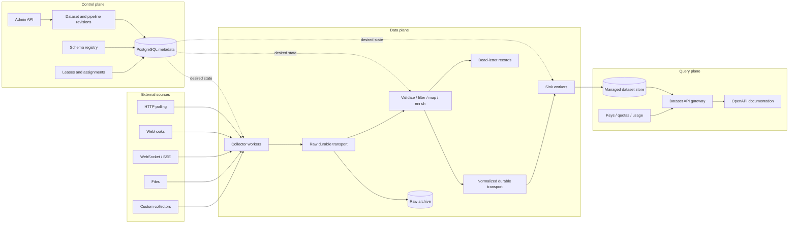

# Self-Hosted Dataset Publishing Platform - Design Review

- Status: Proposed for review
- Version: 2.0
- Date: 2026-07-30
- Primary language: Go
- Initial deployment: Docker Compose
- Intended reader: A developer learning backend engineering and distributed systems

## 1. Executive decision

Build an open-source, self-hosted **dataset publishing platform** that turns pluggable collectors into reliable, versioned, documented read APIs.

The platform accepts records from HTTP polling, webhooks, WebSockets, Server-Sent Events (SSE), files, and custom collectors. It validates and transforms those records, retains enough raw history to replay them, materializes normalized datasets, and publishes controlled APIs with keys, quotas, pagination, and usage metrics.

The strongest product abstraction is a **dataset package**, not an unrestricted data pipeline:

```text
collector definition
+ collector capability declaration
+ raw event contract
+ versioned normalized schema
+ transformation rules
+ storage mapping
+ generated API contract
+ retention and replay policy
```

The project should not claim to replace Kafka Connect, Apache NiFi, Airbyte, Redpanda Connect, Hasura, or Kong. Its defensible value is the integrated, local-first path from collector to API, with language-neutral extension points and a small PostgreSQL-only personal deployment.

The software license does not grant rights to collect, store, or resell third-party data. Operators remain responsible for source terms, database rights, privacy obligations, attribution, and redistribution permission. Dataset-package metadata records those claims; it does not confer rights.

### Senior review verdict

Proceed with the following constraints:

1. Start as a modular monolith with explicit control-plane, data-plane, and query-plane package boundaries.
2. Guarantee automatic API publication only for the managed PostgreSQL record store in v1. V1 defines a sink contract and ships PostgreSQL plus development stdout/file sinks; every additional sink requires an implementation and a declared capability profile.
3. Promise at-least-once delivery plus idempotent materialization, not universal exactly-once delivery.
4. Treat custom collectors as trusted operator-installed software in v1. Running untrusted tenant code is a separate product and security problem.
5. Keep billing, a visual pipeline editor, arbitrary joins, Kubernetes, and a general API gateway out of v1.
6. Ship a useful vertical slice before introducing Kafka, then make Kafka earn its place through replay, outage recovery, and horizontal-scaling demonstrations.

## 2. Product definition

### Product statement

> Define a dataset, attach a source, normalize its records, choose a destination, and publish a self-hosted API without building a separate ingestion platform for every source.

### Target users

1. **Personal operator** - collects data locally and exposes a private or small public API.
2. **Open-source maintainer** - publishes reusable dataset packages and collectors.
3. **Small API operator** - operates a public read API with keys, quotas, caching, and usage reporting. Subscriptions, payments, tax, customer portals, abuse operations, formal SLAs, and hard multi-tenant isolation remain external or post-v1 concerns.
4. **Connector developer** - implements a source integration in Go or another language.

### Primary use cases

- Collect a public WebSocket stream and publish selected normalized records.
- Poll a documented HTTP API with rate limits and resumable checkpoints.
- Receive third-party webhooks and persist them reliably.
- Correct a transformation bug and replay retained raw events.
- Scale transformation and sink workers horizontally without duplicating logical results.
- Expose a dataset through a documented read API with API keys and quotas.
- Install example dataset packages for sports, Wikimedia, Bluesky, or market data.

## 3. Goals and non-goals

### Goals for v1

- One-command local deployment through Docker Compose.
- Generic HTTP polling, webhook, WebSocket, SSE, file, and fixture collectors.
- A versioned, language-neutral collector protocol.
- Bounded buffers, backpressure, retries, checkpoints, deduplication, and a dead-letter queue (DLQ).
- Versioned JSON Schema validation and a deliberately small mapping/filter language.
- Retained raw observations and replay through an immutable pipeline revision. Results are deterministic only when transforms are pure/version-pinned and any enrichment inputs are captured.
- PostgreSQL materialization with idempotent writes.
- Read-only dataset APIs with cursor pagination and allow-listed filters and sorts.
- OpenAPI output, API keys, quotas, and basic usage counters.
- A lightweight single-host mode and a Kafka-backed clustered mode.
- Metrics, structured logs, traces, health checks, and freshness reporting.
- Reproducible load and failure tests with published results.

### Explicit non-goals for v1

- Hundreds of connectors.
- General change-data-capture (CDC).
- A visual drag-and-drop DAG editor.
- Arbitrary SQL, joins, or query federation.
- A data warehouse, object store, or message broker implementation.
- Stateful stream joins or a general stream-processing engine.
- A full billing/payment system.
- A complete API gateway or identity provider.
- A multi-tenant SaaS control plane.
- Execution of untrusted tenant code.
- A Kubernetes operator.
- Universal exactly-once delivery.
- Automatic generation of equivalent query APIs for every possible database.

## 4. Competitive boundary

Every individual layer has mature competitors. The project must learn from them without recreating their entire scope.

| Existing system | Verified overlap | Boundary for this project |
|---|---|---|
| [Kafka Connect](https://kafka.apache.org/43/kafka-connect/overview/) | Distributed source/sink connectors, offsets, REST management, scaling | Do not compete on the Java connector catalog; add dataset lifecycle and API publication |
| [Apache NiFi](https://nifi.apache.org/nifi-docs/overview.html) | Visual flows, persistent queues, backpressure, replay, provenance, clustering | Remain developer-first and dataset-as-code; do not build a visual flow editor in v1 |
| [Airbyte](https://docs.airbyte.com/) | Self-hosted replication, connectors, schema propagation | Focus on continuous/near-real-time collection where sources support it and API publication, not warehouse ELT. Airbyte Core/current connectors use its [ELv2 license](https://github.com/airbytehq/airbyte/blob/master/LICENSE); do not reuse them as a commercial foundation without license review |
| [Redpanda Connect](https://docs.redpanda.com/connect/components/about/) | Go data plane, declarative input/process/output pipelines, transformations | Build the control plane, dataset contract, language-neutral SDK, and generated API experience; its [licensing documentation](https://docs.redpanda.com/connect/get-started/licensing/) also distinguishes free and enterprise components |
| [Vector](https://vector.dev/docs/introduction/concepts/) | High-throughput sources/transforms/sinks, buffers, acknowledgements | Apply reliability patterns to general datasets rather than observability-only data |
| [Hasura](https://hasura.io/rest-api/database) and [PostgREST](https://github.com/PostgREST/postgrest) | Database-backed API generation and authorization | Connect ingestion, lineage, replay, and dataset versions to API publication |
| [Kong Gateway](https://docs.konghq.com/gateway/latest/key-concepts/consumers/) | API consumers, authentication, rate limiting, routing | Provide basic self-contained controls and integrate with a real gateway for advanced operation |

### Differentiation to protect

- The dataset package is portable between lightweight and clustered deployments.
- Collector capabilities are machine-readable declarations: resumability, partitionability, ordering, acknowledgement behavior, and rate limits. Conformance tests verify checkpoint restoration, duplicate behavior, cancellation, backpressure, and partition claims. Freshness is an observed target, not a guaranteed capability.
- Custom collectors run out of process and can be written in any language.
- Raw observations can be replayed through new schema and transformation versions.
- A normalized managed dataset becomes a documented API through one dataset definition and control surface.
- Dataset packages carry source-license, redistribution, attribution, and operational metadata.

## 5. Architectural principles

1. **Logical boundaries before network boundaries.** Begin with packages and interfaces, then split deployable processes only for measured scaling or isolation needs.
2. **Durability before acknowledgement.** Advance a source checkpoint only after the platform has durably accepted the event.
3. **Bound every queue and batch.** An unbounded queue converts backpressure into an eventual outage.
4. **Assume duplicate delivery.** Every state-changing consumer must be idempotent.
5. **Ordering is scoped, never global by default.** Preserve order for a declared partition key while retaining parallelism across keys.
6. **Raw and normalized data have different lifecycles.** Preserve raw observations for repair and replay; serve normalized projections for queries.
7. **The control plane never carries the event stream.** If the control API is down but metadata PostgreSQL remains available, established pipelines continue normally. If metadata PostgreSQL is down, collectors stop durable admission before their leases expire; Kafka processors may continue only with a pinned valid revision, while PostgreSQL-backed personal mode stops durable admission.
8. **Configuration is versioned data.** Pipeline, schema, and API changes are reviewable revisions rather than mutable mystery state.
9. **Security follows the data path.** Source credentials, payloads, generated queries, custom code, and public APIs are separate threat surfaces.
10. **Performance claims require measurements.** Publish hardware, configuration, dataset, throughput, latency, errors, and resource consumption together.

## 6. Logical architecture



### Planes

#### Control plane

Stores desired state and operational metadata:

- Projects and datasets
- Versioned pipeline specifications
- Connector instances and capability manifests
- Schema revisions
- Secret references, never plaintext secrets in ordinary configuration
- Worker leases, fencing tokens, and checkpoints
- Dataset API policies and API-key hashes
- Deployment status and audit history

#### Data plane

Moves and transforms events:

- Owns source connections and polling schedules
- Applies rate limits, timeouts, and retry classifications
- Publishes raw envelopes
- Validates, filters, maps, enriches, and deduplicates
- Routes poison records to a DLQ
- Writes normalized records to sinks
- Replays retained events

#### Query plane

Serves consumers without joining the ingestion hot path:

- Reads normalized managed datasets
- Applies authentication, authorization, filters, sorts, and pagination
- Enforces request limits and quotas
- Produces OpenAPI descriptions
- Records usage without synchronously coupling requests to billing systems

## 7. Deployment evolution

### Lab mode

```text
collector -> bounded Go channel -> transformer -> stdout/file
```

Purpose: learn interfaces, concurrency, cancellation, backpressure, and testing. This mode is intentionally not durable.

### Personal mode

```text
one Go binary + PostgreSQL
```

PostgreSQL stores control-plane state, a durable event journal, checkpoints, normalized records, and API metadata. This is the smallest responsible self-hosted product mode. It avoids making Kafka mandatory for a personal installation.

The personal-mode journal has explicit queue semantics rather than pretending a table is Kafka. Each row has a monotonic journal sequence, partition key, envelope, attempt count, `available_at`, claim owner, and visibility deadline. Admission inserts the raw event and advances its collector checkpoint in one transaction. Workers claim ready rows through short `FOR UPDATE SKIP LOCKED` transactions, process them outside the claim transaction, and acknowledge or reschedule them before the visibility lease expires. V1 processes each logical partition serially, retains terminal metadata for audit/idempotency, and prunes acknowledged payloads according to policy. A crash makes an unacknowledged row visible again.

### Provider mode

```text
control API
+ collector workers
+ Kafka
+ processor workers
+ sink workers
+ query gateway replicas
+ PostgreSQL
+ optional Redis / object storage
```

Each worker role becomes independently scalable. Kafka supplies partitioned transport, retention, replay, and consumer-group coordination. Redis is optional for distributed rate-limit state and caching; object storage is optional for longer raw retention.

### Process strategy

Initially ship one binary with explicit subcommands:

```text
platform server
platform worker collector
platform worker processor
platform worker sink
platform replay
platform validate
```

Personal mode can run the roles together. Provider mode runs the same image with different commands. This avoids premature repositories and duplicated deployment logic while preserving independent scaling.

## 8. Repository framework

```text
cmd/platform/                  executable wiring only
internal/control/             control-plane application services
internal/runtime/             pipeline lifecycle and supervision
internal/collector/           built-in collector implementations
internal/processor/           validation and transformation
internal/transport/           in-memory, PostgreSQL, and Kafka transports
internal/materializer/        idempotent normalized writes
internal/query/               safe dataset query model
internal/apigateway/          consumer API, keys, quotas, usage
internal/metadata/            fixed control-plane persistence
internal/recordstore/         managed dataset persistence
internal/observability/       logs, metrics, and tracing setup
internal/testkit/             fixtures, fake clocks, fault injection
pkg/connectorprotocol/        stable public protocol types
sdk/go/collector/             supported Go SDK
api/                          OpenAPI and protocol definitions
examples/datasets/            installable example dataset packages
docs/adr/                     architecture decision records
docs/runbooks/                operational recovery procedures
```

Rules:

- `cmd` contains construction and lifecycle wiring, not business logic.
- Internal packages depend on contracts owned by the consumer package.
- Provider payload structs never become storage or public API types.
- Transport-specific Kafka types do not leak into domain contracts.
- The public SDK is versioned separately from internal implementation details.

## 9. Dataset package contract

A dataset package is a versioned directory or OCI artifact containing:

```text
dataset.yaml
schemas/raw/*.json
schemas/normalized/*.json
transforms/*
fixtures/*
tests/*
README.md
LICENSE
SOURCE_POLICY.md
```

Illustrative configuration:

```yaml
apiVersion: platform.example/v1alpha1
kind: Dataset

metadata:
  name: public-posts
  version: 1.0.0

source:
  connector: websocket
  config:
    url: ${SOURCE_URL}
    maxMessageBytes: 1048576
  capabilities:
    resumable: true
    partitionable: false
    ordering: source

record:
  schema: social.post.v1
  key: post_id
  occurredAt: created_at
  partitionKey: author_id

pipeline:
  steps:
    - filter: event.kind == "post"
    - map:
        post_id: event.id
        author_id: event.author
        text: event.text
        created_at: event.created_at

storage:
  sink: managed-postgres
  indexes: [author_id, created_at]

api:
  enabled: true
  path: /v1/public-posts
  filters: [author_id, created_at]
  sorts: [created_at]
  pageSize:
    default: 100
    maximum: 1000

retention:
  raw: 7d
  normalized: 365d

sourcePolicy:
  license: declared-by-package
  redistribution: review-required
  attribution: required
```

Configuration must be validated before activation. Activation produces an immutable revision. Workers continue using the last valid revision when only the control API is temporarily unavailable. Loss of the metadata database follows the stricter lease and admission behavior defined above.

Retention values are capacity policies, not promises of infinite storage. Operators configure raw-event, normalized-record, revision, and tombstone retention plus byte/record quotas. The platform reports approaching limits, prunes only according to declared policy, and refuses unsafe replay when required history has expired.

## 10. Event contract

Use [CloudEvents 1.0](https://github.com/cloudevents/spec/blob/main/cloudevents/spec.md) as the portable outer envelope, with platform-specific extension attributes. CloudEvents already defines the semantics of `id`, `source`, `type`, `subject`, `time`, `dataschema`, and `data`; adopting it reduces unnecessary proprietary protocol design. The `data` field follows a versioned dataset schema.

```json
{
  "specversion": "1.0",
  "id": "source-event-or-stable-hash",
  "source": "urn:collector:example-stream:posts",
  "type": "dev.platform.social.post.observed.v1",
  "subject": "post-991",
  "time": "2026-07-30T20:01:01Z",
  "datacontenttype": "application/json",
  "dataschema": "urn:schema:social.post:1",
  "projectid": "project_123",
  "pipelineid": "pipeline_456",
  "dataset": "public-posts",
  "stream": "posts",
  "partitionkey": "author-42",
  "sourcecursor": "opaque-source-cursor",
  "ingestedat": "2026-07-30T20:01:02Z",
  "payloadhash": "sha256:...",
  "pipelinerevision": 7,
  "traceparent": "00-...",
  "data": {}
}
```

### Identity semantics

- CloudEvents defines the pair `(source, id)` as the identity of a distinct event. Prefer a source-provided event/revision ID, then a source sequence or cursor, then a deterministic hash of stable source fields. If only a generated ID is possible, the connector must declare that reliable cross-restart deduplication is unavailable.
- `subject` identifies the logical entity or record that may receive corrections over time. A correction is a new event with a new event identity but the same logical subject.
- `partitionkey` defines the scope in which ordering must be preserved.
- `sourcecursor` is diagnostic event metadata. The authoritative committed checkpoint is maintained separately by the collector runtime; downstream consumers never advance source progress. Treat the cursor as potentially sensitive: do not expose it through generated APIs or ordinary logs; encrypt or redact it when a source requires that treatment.
- `payloadhash` detects corruption and supports identity construction only where the connector contract defines it.

Keeping these concepts separate prevents the common mistake of treating event identity, logical-record identity, delivery attempts, and source checkpoints as the same thing.

### Normalized record contract

Raw events describe source observations. Normalized records describe intended materialized state:

```json
{
  "project_id": "project_123",
  "dataset_id": "public-posts",
  "record_key": "post-991",
  "operation": "upsert",
  "schema_id": "urn:schema:social.post:1",
  "schema_version": 1,
  "occurred_at": "2026-07-30T20:01:01Z",
  "source_event_source": "urn:collector:example-stream:posts",
  "source_event_id": "source-event-or-stable-hash",
  "pipeline_revision": 7,
  "data": {}
}
```

V1 supports only `upsert` and `delete`. The normalized partition key is `(project_id, dataset_id, record_key)` so changes to one logical record can remain ordered. Processing must be key-affine/per-partition: a worker may process different partitions concurrently, but it must not apply records from one partition out of order. Offset commits advance only through a contiguous completed offset, and a poison record receives bounded per-partition handling before DLQ routing.

## 11. Delivery and checkpoint semantics

The v1 contract is **at-least-once delivery with idempotent effects**.

### Collector sequence

1. Receive or poll a source observation.
2. Validate envelope limits and compute identity fields.
3. Publish the raw event to durable transport.
4. Wait for the transport acknowledgement.
5. Persist/advance the source checkpoint.

If the worker crashes after step 3 but before step 5, it may publish the event again. The dedupe key makes that safe.

### Processor sequence

1. Read a raw event.
2. Validate and transform it.
3. Publish the normalized event or DLQ record durably.
4. Commit the raw transport offset.

### Sink sequence

1. Read a normalized event.
2. Execute an idempotent database transaction.
3. Commit the normalized transport offset.

For the managed record store, the processed-event identity includes `(project_id, dataset_id, projection_version, source_event_source, source_event_id, output_ordinal)`. This allows one source event to feed multiple datasets, projection versions, or outputs while preventing duplicate effects within one target. The processed marker and record mutation commit in the same database transaction. `(project_id, dataset_id, record_key)` identifies current logical state. Corrections create a new event and record revision rather than being discarded as duplicate deliveries.

Idempotency does not prevent an old replayed event from overwriting newer state. Current-state writes therefore require a source monotonic version/sequence or strict per-record order plus a conditional upsert. Schema rebuilds replay into an isolated projection. Same-projection DLQ recovery refuses to overwrite a newer record unless the dataset declares and satisfies an explicit version comparison.

Kafka transactions may later improve Kafka-to-Kafka processing, but they cannot alone create universal exactly-once behavior across external sources, arbitrary databases, webhooks, and client-visible APIs.

## 12. Backpressure and overload policy

Every boundary has a bounded number of in-flight records and bytes.

```text
source -> bounded input -> fixed worker pool -> bounded batcher -> transport/sink
```

Behavior depends on source capability:

- Polling collectors delay the next poll.
- Webhook endpoints return an overload response when durable admission is unavailable.
- Resumable streams pause or reconnect from the last durable cursor.
- Non-resumable streams must declare an explicit `block`, `disconnect`, or `best-effort-drop` policy.
- The platform never silently creates an unbounded in-memory queue.

Track both record count and byte size. Ten giant messages can exhaust memory even when a record-count limit looks safe.

## 13. Horizontal and vertical scaling

### Vertical scaling

One Go process uses bounded worker pools, batching, connection pools, and controlled goroutine counts. Increase CPU and memory only after profiling identifies the bottleneck.

Important tuning variables:

- Maximum concurrent collectors
- Per-pipeline in-flight records and bytes
- Transform worker count
- Producer and sink batch size and linger time
- Database connection count
- Payload size and retention

Larger batches improve throughput but consume more memory and increase per-record latency.

### Horizontal processor and sink scaling

Kafka partitions are the maximum active parallelism of a consumer group. Events with the same `partition_key` go to the same partition, preserving order within that key while allowing other keys to run concurrently. [Kafka documents partition ordering and key placement](https://kafka.apache.org/documentation/).

Tradeoff:

```text
stronger ordering scope -> fewer independent keys -> less parallelism
```

Choose `record_key` or a domain entity ID when related changes must be ordered. Avoid `source` as the default key because a high-volume source can become one hot partition.

### Collector scaling

Collectors do not automatically scale through a consumer group because they originate work. Use renewable assignments:

```text
pipeline_id
shard_id
owner_id
lease_expires_at
fencing_token
checkpoint
```

- Partitionable collectors expose shards that can be assigned independently.
- Singleton streams receive one active lease.
- Workers renew leases before expiration.
- Every ownership change increments a fencing token.
- Every raw event carries the collector lease epoch. Standard Kafka does not validate a PostgreSQL lease epoch, so it may accept a stale owner's raw event. Processors compare the epoch with authoritative ownership and quarantine/ignore obsolete writes before materialization. A collector that cannot renew must stop before its lease expires.

Leases provide failover; they do not eliminate duplicates. Idempotency remains required.

### Query scaling

Query-gateway instances are stateless apart from bounded local caches. Add replicas behind a reverse proxy. PostgreSQL and distributed rate-limit state eventually become the shared bottlenecks, so scale them based on measured query plans, cache hit rate, connection saturation, and lock contention.

## 14. Kafka topic strategy

Begin clustered mode with shared topics per environment:

```text
platform.raw.v1
platform.normalized.v1
platform.dlq.v1
```

Include `project_id`, `dataset`, and `pipeline_id` in every envelope and authorization policy. Shared topics reduce topic-count and operational overhead for small installations.

Kafka has no server-side per-record filter, so v1 uses one multiplexing processor consumer group for the shared raw topic. It dispatches records to active immutable pipeline revisions internally while preserving partition order. A multiplexing sink group similarly routes normalized records to configured sink implementations. Replay jobs use separate consumer groups and isolated output projection versions. This design accepts weaker per-pipeline isolation; high-volume, sensitive, or distinct-retention workloads receive a topic bucket or dedicated topic instead of making every pipeline consume and discard all installation traffic.

Tradeoffs of shared topics:

- Simpler operations and consumer deployment
- Greater noisy-neighbor risk
- One retention policy may not suit every dataset
- Replay consumers must filter efficiently

Add optional dedicated topics for high-volume or regulated datasets later. Do not create a topic for every tiny pipeline by default.

Shared topics are internal infrastructure. Dataset consumers never receive broker credentials for them. If direct Kafka access is offered later, use dedicated topics or clusters with broker-enforced authorization.

## 15. Schemas and transformations

### v1 format

- JSON payloads
- JSON Schema for raw and normalized records
- Immutable schema versions
- Explicit compatibility checks during activation
- A small declarative structural mapping format
- [Common Expression Language (CEL)](https://github.com/cel-expr/cel-go) for bounded filters and computed expressions

CEL is non-Turing-complete and designed for safe, fast expression evaluation. It is preferable to arbitrary embedded Go, JavaScript, or Python for simple user-defined expressions.

### Schema evolution

- Backward-compatible additions can produce a new minor dataset revision.
- Renames, removals, or type changes require a new major API/schema version.
- Pipeline revisions pin exact input and output schema versions.
- Replay records a source watermark, writes to a new projection version, consumes the live tail until a readiness watermark, and only then performs an atomic API alias switch. Abort if required raw retention expires before catch-up completes.
- Old API versions have an explicit deprecation and retention window.

Do not add Avro, Protobuf, or a separate schema-registry product until JSON parsing cost, payload size, or cross-language contracts justify it.

## 16. Storage model

### Managed PostgreSQL record store

The generated API is guaranteed for this store. A starting model is:

```text
datasets
dataset_schema_versions
dataset_records
dataset_record_revisions
raw_event_metadata
dead_letter_records
api_consumers
api_keys
usage_buckets
```

`dataset_records` contains stable typed metadata plus a JSONB document:

```text
project_id
dataset_id
record_key
current_revision
occurred_at
observed_at
document JSONB
created_at
updated_at
deleted_at
```

This design makes arbitrary schemas practical while retaining stable identifiers and timestamps. Its cost is weaker database-level typing and potentially expensive JSON-path queries. Only fields declared in the dataset package may be filtered or sorted. The platform caps index count and supported index forms, validates field types, creates large indexes without blocking ordinary writes where PostgreSQL permits it, exposes build status, and enables a filter only after its required index is ready.

Later, high-volume packages may select generated typed tables or ClickHouse. That is an optimization with migration and schema-evolution costs, not the v1 default.

### Sink capabilities

V1 ships managed PostgreSQL plus stdout/file development sinks and defines a contract for future Kafka, webhook, object-storage, or database sinks. Each sink declares whether it supports idempotency, batching, ordering, deletion, transactions, and acknowledgements. The platform guarantees idempotent materialization only for sinks it controls and tests. A webhook receives a stable `Idempotency-Key`, but duplicate external effects remain possible unless the receiver cooperates. A non-managed sink does **not** automatically receive a generated query API; it must later implement a query-adapter contract or operate independently of the query plane.

## 17. Generated API contract

The initial consumer API is deliberately read-only:

```text
GET /api/v1/datasets/{dataset}/records
GET /api/v1/datasets/{dataset}/records/{recordKey}
GET /api/v1/datasets/{dataset}/schema
GET /api/v1/datasets/{dataset}/openapi.json
```

Supported behavior:

- Cursor pagination, not arbitrary offset pagination
- Bounded page sizes
- Equality/range filters for allow-listed schema fields
- Allow-listed sorts with a deterministic tie-breaker
- ETag/conditional requests
- Stable error envelopes
- Dataset and API version headers
- Optional freshness/provenance metadata

Pagination cursors are signed, opaque payloads containing projection/schema revision, sort values, filter hash, and expiry. A cursor is rejected after an incompatible projection alias switch instead of silently returning missing or duplicated pages.

The query builder must resolve fields from the active schema, map them to reviewed SQL expressions, and bind values as parameters. Never concatenate user-provided JSON paths, operators, sort expressions, or identifiers into SQL.

### API consumers

- Store API-key hashes, a visible prefix, status, scopes, and expiration; never store retrievable keys.
- Use a local token bucket in personal mode.
- Use shared state such as Redis only when multiple gateway replicas require a globally coordinated limit.
- Record usage asynchronously in time buckets.
- Defer payments, invoices, tax, and plan management. A future billing integration consumes usage records.
- Allow an external gateway such as Kong to replace advanced enforcement rather than reproducing its entire feature set.

## 18. Connector extension model

### Built-in generic collectors

Implement common protocols inside the core distribution:

- Fixture/generator
- File and NDJSON
- HTTP polling
- Webhook receiver
- WebSocket
- SSE

Many sources should require configuration and mappings, not custom code.

### External connector protocol

Avoid Go native `.so` plugins. They are tightly coupled to Go toolchain and dependency versions and offer weak failure isolation.

Use a versioned external-process protocol, initially gRPC with an NDJSON debugging adapter. The protocol supports:

- Version/capability handshake
- Configuration schema
- Health and readiness
- Start/stop lifecycle
- Event stream with bounded credits or maximum in-flight messages
- Acknowledgements
- Checkpoint restore and commit notification
- Structured error classification
- Metrics labels

Custom connectors run as separate processes or containers. In v1 they are trusted by the operator. Container isolation limits accidental crashes but is not a complete sandbox.

An event acknowledgement means the host durably admitted the referenced event; a checkpoint-commit notification is sent only after the metadata checkpoint transaction commits. Acknowledgements carry explicit event/checkpoint candidate IDs, credits are replenished only after durable admission, and reconnect restores only the last committed checkpoint.

## 19. Security and responsible data use

### Threats that must be designed early

| Threat | Required control |
|---|---|
| Server-side request forgery from configurable URLs | URL validation, private-network blocking by default, redirect policy, explicit operator override |
| Credential exposure | Environment/file secret references, redaction, no payload/header logging |
| Oversized or compressed payload attacks | Body, decompression, nesting, and processing-time limits |
| Malicious custom connector | Separate process/container, resource limits, explicit trust warning |
| Generated-query injection | Schema allow-lists and parameterized SQL |
| Cross-project data exposure | Project scoping in every query and authorization test |
| API-key theft | One-time display, hashes at rest, rotation, scopes, expiration |
| Replay abuse | Admin authorization, audit log, target projection isolation |
| Unlicensed collection or redistribution | Dataset-package source policy and connector enablement review |

Provider mode initially supports many API consumers, not many mutually untrusted platform administrators. Full operator multi-tenancy would require stronger secret isolation, network policy, per-tenant resource scheduling, audit controls, and billing isolation.

### Open-source license recommendation

Use **Apache-2.0** as the default project license if the promise is that anyone may self-host the software or use it to provide a paid data API. It is permissive and includes an explicit patent grant. Choose AGPL only if network copyleft is an intentional product goal and reduced commercial adoption is acceptable. Do not call an ELv2-style field-of-use restriction OSI open source.

This is engineering guidance, not legal advice. Dataset packages independently declare software license, source-data license, terms/policy notes, attribution, polling limits, secrets, and redistribution status.

The project also needs an ecosystem license policy: SPDX identifiers in package manifests, an approved/review-required dependency and connector license list, automated dependency scanning, a documented DCO-versus-CLA contribution decision, and rules for distributing differently licensed out-of-process connectors. An Apache-2.0 core does not make every connector or dataset package Apache-2.0.

## 20. Observability and service objectives

### Required telemetry

- Records and bytes accepted, rejected, retried, duplicated, transformed, materialized, and dead-lettered
- Queue depth and bytes, worker saturation, batch sizes, and processing duration
- Source last-success time, checkpoint age, reconnects, rate-limit responses, and freshness
- Kafka produce latency, consumer lag, partition assignment, and rebalance count
- PostgreSQL pool saturation, transaction latency, conflicts, and query duration
- API request rate, latency, errors, cache hit rate, rate-limit decisions, and usage records
- Structured logs containing project, dataset, pipeline, event, record, and trace identifiers
- Traces across collector admission, processing, materialization, and query handling where sampling cost is acceptable

[OpenTelemetry Go](https://opentelemetry.io/docs/languages/go/) currently marks traces and metrics stable; logs remain less mature, so use `log/slog` for application logs and correlate them with trace IDs.

### Honest reliability objectives

Do not publish throughput or availability promises before measuring them. Initial acceptance objectives are behavioral:

- No accepted event is lost during a graceful worker restart.
- A forced crash may cause redelivery but not duplicate logical state.
- A stopped sink can catch up from retained transport after recovery.
- A corrected transform can rebuild a fresh projection from raw history.
- A lost collector lease fails over without accepting obsolete-owner writes indefinitely.
- The API reports data freshness separately from process health.

The benchmark report must state hardware, OS, broker configuration, partition count, record-size distribution, durability settings, dataset/index configuration, and test duration.

## 21. Failure-mode review

| Failure | Expected behavior | Test |
|---|---|---|
| Source timeout or 429 | Bounded backoff with jitter; no checkpoint advance | Scripted fake source |
| Malformed payload | Quarantine/DLQ with bounded diagnostic data | Invalid fixtures and fuzzing |
| Collector crash after publish | Redelivery accepted; duplicate effect suppressed | Kill process at acknowledgement boundary |
| Control API unavailable, metadata DB healthy | Existing revision continues; new changes pause | Stop only the API |
| Metadata PostgreSQL unavailable | Collectors stop admission before lease expiry; Kafka processors use pinned configuration where safe; personal mode stops durable admission | Stop only metadata PostgreSQL |
| Kafka unavailable | Bounded producer buffer, backpressure, visible unhealthy state | Stop broker under load |
| Processor poison event | Retry only classified transient errors, then DLQ | Deterministic poison fixture |
| Serving PostgreSQL unavailable | Sink offsets do not advance; Kafka mode catches up after recovery | Stop and restart database |
| Hot partition | Lag isolated and visible; repartitioning decision documented | Skewed key load test |
| Lease owner pause | Lease expires; new owner uses higher fencing token | Suspend worker process |
| Schema change breaks mapping | Activation rejected before production | Contract tests against fixtures |
| API traffic spike | Bounded concurrency and rate limits protect database | k6 load test |
| Replay mistake | New projection target and audit trail; no silent overwrite | Replay runbook exercise |

## 22. Technology framework and tradeoffs

| Concern | Initial choice | Why | Important cost |
|---|---|---|---|
| Language | Go | Concurrency, simple binaries, strong tooling, infrastructure relevance | Less framework-provided structure than Spring/.NET |
| HTTP | `net/http`, optionally `chi` | Small abstraction and standard middleware model | More explicit wiring and validation |
| Metadata database | PostgreSQL | Transactions, constraints, JSONB, operational familiarity | Requires schema/index discipline |
| Go database access | `pgx`; `sqlc` for fixed metadata queries | Explicit SQL and type safety | Dynamic dataset queries need a separate safe builder |
| Migrations | `goose` | Simple versioned SQL migrations | Migration compatibility remains the team's responsibility |
| Local durable transport | PostgreSQL event journal | Minimal personal deployment | Lower streaming throughput and more DB contention than Kafka |
| Cluster transport | Apache Kafka with `franz-go` | Retention, replay, partitions, consumer groups | Significant operational complexity |
| Payload/schema | JSON + JSON Schema | Accessible and extensible | More CPU/bytes and weaker typing than binary formats |
| Expressions | CEL | Bounded, non-Turing-complete evaluation | Not a full transformation language |
| Collector protocol | gRPC plus NDJSON debug adapter | Streaming, typed cross-language contract | Protocol versioning and process lifecycle complexity |
| Telemetry | OpenTelemetry + Prometheus + `slog` | Portable metrics/traces and structured logs | Cardinality and sampling must be controlled |
| Local deployment | Docker Compose profiles | Reproducible optional service sets | Not a production orchestrator |
| UI | React + TypeScript after API stabilizes | Familiar operator console ecosystem | Can distract from data-plane reliability |
| Load tests | k6 plus Go benchmarks | API and internal performance coverage | Results depend heavily on realistic workloads |

Docker Compose supports multi-service application definitions and optional profiles, making it appropriate for `personal` and `provider` local profiles. [Docker Compose application model](https://docs.docker.com/compose/intro/compose-application-model/) and [profiles](https://docs.docker.com/reference/compose-file/profiles/).

## 23. Learning-first build timeline

Assumption: 8-12 focused hours per week and limited prior Go/Kafka experience. The realistic path is approximately **38-48 focused weeks**, or roughly 10-14 calendar months with normal interruptions and debugging. A usable personal-mode MVP should exist around weeks 18-20. The lower end assumes consistent work and few redesigns; the upper end is more credible for a first large Go/Kafka system. Acceptance criteria, not dates, determine completion.

### Phase 0 - Foundation (weeks 1-2)

Build:

- Install Go, Git, Docker Desktop, and an editor.
- Initialize the module and CI.
- Learn packages, errors, interfaces, tests, contexts, and JSON.

Done when:

- `go test ./...` and `go vet ./...` pass.
- A small HTTP health endpoint shuts down cleanly.

### Phase 1 - In-memory data plane (weeks 3-4)

Build:

- Canonical event envelope.
- Generator collector and stdout sink.
- Bounded channel, cancellation, and explicit ownership of channel closure.
- Unit tests using a fake clock where useful.
- Structured logs plus basic accepted/rejected, queue-depth, throughput, and error metrics.

Experiments:

- Make the sink slower than the source.
- Compare unbuffered and bounded buffered channels.
- Record queue depth and memory behavior.

Done when:

- Clean shutdown has no goroutine leaks.
- Backpressure is observable and explainable.
- Race-enabled tests pass on a supported toolchain.

### Phase 2 - Configured collectors (weeks 5-9)

Build:

- Fixture/file collector.
- HTTP polling collector with timeouts, rate limits, pagination, and retry classification.
- One streaming collector, initially SSE; WebSocket and webhook support are scheduled later.
- Versioned YAML dataset configuration.
- Collector capability manifest.

Experiments:

- Simulate timeouts, 429s, malformed JSON, disconnects, and stale cursors.

Done when:

- All reliability behavior runs offline against deterministic fake sources.
- No secret or full sensitive payload appears in logs.

### Phase 3 - Validation and transformation (weeks 10-13)

Build:

- JSON Schema registry and validation.
- Structural field mapping.
- Deterministic structural field selection/renaming and simple filters first; CEL computed values only after that contract is stable, with expression-size and evaluation-cost limits.
- Local retry and DLQ records.
- Immutable pipeline revisions.

Experiments:

- Activate compatible and incompatible schema changes.
- Fuzz parsers and mapping inputs.

Done when:

- Invalid configuration cannot activate.
- Bad records do not crash or block the entire pipeline.

### Phase 4 - Durable personal MVP (weeks 14-20)

Build:

- PostgreSQL metadata and event journal.
- Durable checkpoints.
- Managed JSONB record store.
- Idempotent materializer.
- Read-only records API with cursor pagination and allow-listed filters.
- Docker Compose personal profile.
- PostgreSQL pool, transaction, batch, and query-duration metrics.

Experiments:

- Crash after durable event admission but before checkpoint commit.
- Stop PostgreSQL and verify bounded memory, a visible unhealthy state, no checkpoint advancement, and source backpressure/reconnect. Personal mode cannot durably accept new records while its only durable store is unavailable.
- Deliver identical events multiple times.

MVP release criterion:

- A fresh clone can install one dataset package, collect real permitted data, recover from a restart, and serve a documented local API without Kafka.

### Phase 5 - Kafka clustered data plane (weeks 21-25)

Build:

- Kafka transport through `franz-go`.
- Raw, normalized, and DLQ topics.
- Separate collector, processor, and sink subcommands.
- Consumer-group offset handling and lag metrics.
- Commit-after-sink semantics from the start; correctness is not deferred to the following failure-testing phase.
- Replay command targeting a new projection.

Experiments:

- Run one, two, four, and more workers up to partition count.
- Stop sink workers while collection continues, then measure catch-up.
- Test hot keys and consumer rebalances.

Done when:

- Kafka demonstrates replay, outage isolation, and horizontal scaling rather than merely appearing in the architecture.

### Phase 6 - Delivery guarantees and failure recovery (weeks 26-29)

Build:

- Commit-after-sink behavior and documented crash boundaries.
- Retry classification and bounded retry budgets.
- DLQ inspection and replay commands.
- Durable checkpoint recovery.

Experiments:

- Kill a worker before materialization, after the database commit, and before offset commit.
- Restart the broker and introduce latency/disconnects with [Toxiproxy](https://github.com/Shopify/toxiproxy).
- Pause PostgreSQL until lag grows, restore it, and measure catch-up time.

Done when:

- Accepted events eventually materialize after recovery.
- Duplicate delivery attempts do not create duplicate logical effects.
- Poison records do not block a partition forever.

### Phase 7 - Collector ownership and failover (weeks 30-33)

Build:

- Shard declarations.
- Renewable leases, fencing tokens, heartbeats, and checkpoint restore.

Experiments:

- Kill, suspend, and network-isolate a collector worker.
- Verify takeover and stale-owner rejection.

Done when:

- A singleton stream has bounded failover time and duplicate-safe recovery.

### Phase 8 - External connectors and remaining protocols (weeks 34-37)

Build:

- Versioned gRPC external connector protocol and NDJSON debugging adapter.
- One independently built sample connector, preferably in a second language.
- Built-in WebSocket and webhook adapters using the same event/admission contracts.

Experiments:

- Crash, hang, and corrupt the external connector.
- Exhaust its credit window and cancel it during an active source request.

Done when:

- A malformed or crashed connector cannot crash the host runtime.
- Backpressure, acknowledgement, checkpoint restore, and cancellation cross the process boundary.

### Phase 9 - API product controls (weeks 38-42)

Build:

- API consumers and hashed keys.
- Scopes, expiration, quotas, and local token-bucket rate limiting.
- Usage buckets and generated OpenAPI descriptions.
- Optional Redis-backed distributed limiting experiment.

Experiments:

- Burst and sustained-load tests.
- Key rotation/revocation and cross-dataset authorization tests.

Done when:

- Two consumer plans can receive different limits without bypass or cross-dataset access.

### Phase 10 - Operations and UI (weeks 43-45)

Build:

- Dashboards, alerts, tracing expansion, runbooks, and a deliberately minimal React console for pipeline status, freshness, lag, DLQ, replay, keys, and usage. Metrics needed by earlier experiments already exist before this phase.

Done when:

- An operator can diagnose source failure, processor lag, sink failure, and stale data without reading application source code.

### Phase 11 - Hardening and portfolio release (weeks 46-48)

Build:

- Threat-model review, dependency/container scanning, backup/restore documentation.
- Load-test harness and published benchmark report.
- Architecture decision records and a recorded failure/recovery demonstration.
- Apache-2.0 license review and contributor/connector documentation.

v1 release criterion:

- Personal and provider Compose profiles work from a fresh clone.
- At least two materially different real sources and one simulator are included.
- Replay, redelivery, failover, DLQ recovery, and horizontal scaling are demonstrated.
- Limitations and non-guarantees are written as prominently as features.

## 24. Resume and interview evidence

The repository should contain evidence, not adjectives:

- An architecture diagram and versioned ADRs.
- A benchmark report showing throughput, p50/p95/p99 latency, CPU, memory, lag, and test conditions.
- A failure-injection report with screenshots or traces of recovery.
- A schema-evolution and replay demonstration.
- A partition-key experiment showing ordering versus parallelism.
- API threat model and authorization tests.
- A language-neutral example collector outside Go.
- A five-minute demo: install package, ingest, break a worker, recover, replay, and query.

Strong resume phrasing after measurement might be:

> Built a self-hosted dataset publishing platform in Go with pluggable collectors, versioned schemas, Kafka-backed replay, idempotent PostgreSQL materialization, lease-based collector failover, generated read APIs, and measured horizontal-scaling behavior.

Never invent throughput numbers before the benchmark exists.

## 25. Curated learning resources

Read each resource when its milestone requires it; do not postpone building until all reading is complete.

### Go fundamentals and correctness

- [A Tour of Go](https://go.dev/tour/)
- [Effective Go](https://go.dev/doc/effective_go) - useful for core idioms, but its official page notes that it predates modules, generics, and newer libraries; pair it with current tutorials and documentation
- [Go modules tutorial](https://go.dev/doc/tutorial/create-module)
- [`context` package](https://pkg.go.dev/context)
- [Go race detector](https://go.dev/doc/articles/race_detector)
- [Go fuzzing](https://go.dev/doc/security/fuzz/)
- [Go diagnostics](https://go.dev/doc/diagnostics)
- [Go profiling with pprof](https://go.dev/blog/pprof)

### HTTP and APIs

- [`net/http` package](https://pkg.go.dev/net/http)
- [OpenAPI specification](https://spec.openapis.org/oas/latest.html)
- [OWASP API Security Top 10](https://owasp.org/API-Security/)

### PostgreSQL

- [PostgreSQL tutorial](https://www.postgresql.org/docs/current/tutorial.html)
- [JSON types](https://www.postgresql.org/docs/current/datatype-json.html)
- [`INSERT` and `ON CONFLICT`](https://www.postgresql.org/docs/current/sql-insert.html)
- [`EXPLAIN` and query plans](https://www.postgresql.org/docs/current/using-explain.html)
- [PostgreSQL indexes](https://www.postgresql.org/docs/current/indexes.html)
- [Indexes on expressions](https://www.postgresql.org/docs/current/indexes-expressional.html)
- [Transaction isolation](https://www.postgresql.org/docs/current/transaction-iso.html)
- [Explicit locking](https://www.postgresql.org/docs/current/explicit-locking.html)
- [`pgx/v5`](https://pkg.go.dev/github.com/jackc/pgx/v5)
- [`sqlc`](https://docs.sqlc.dev/)
- [`goose`](https://github.com/pressly/goose)

### Kafka and distributed processing

- [Apache Kafka introduction](https://kafka.apache.org/documentation/)
- [Apache Kafka quickstart](https://kafka.apache.org/quickstart/)
- [Kafka design documentation](https://kafka.apache.org/43/design/design/)
- [Kafka Connect overview](https://kafka.apache.org/43/kafka-connect/overview/)
- [`franz-go`](https://github.com/twmb/franz-go)

### Configuration and transformation

- [JSON Schema specification](https://json-schema.org/specification)
- [CEL Go](https://github.com/cel-expr/cel-go)
- [Protocol Buffers](https://protobuf.dev/overview/)
- [gRPC concepts](https://grpc.io/docs/what-is-grpc/core-concepts/)

### Containers, testing, and observability

- [Docker Compose application model](https://docs.docker.com/compose/intro/compose-application-model/)
- [Docker Compose getting started](https://docs.docker.com/compose/gettingstarted/)
- [Docker Compose health checks](https://docs.docker.com/reference/compose-file/services/#healthcheck)
- [Testcontainers for Go quickstart](https://golang.testcontainers.org/quickstart/)
- [Toxiproxy](https://github.com/Shopify/toxiproxy)
- [OpenTelemetry Go](https://opentelemetry.io/docs/languages/go/)
- [Prometheus metric types](https://prometheus.io/docs/concepts/metric_types/)
- [k6 documentation](https://grafana.com/docs/k6/latest/)
- [k6 thresholds](https://grafana.com/docs/k6/latest/using-k6/thresholds/)
- [Automated performance testing with k6](https://grafana.com/docs/k6/latest/testing-guides/automated-performance-testing/)

### Systems to study, not reproduce wholesale

- [Redpanda Connect configuration](https://docs.redpanda.com/connect/configuration/about/)
- [Apache NiFi overview](https://nifi.apache.org/nifi-docs/overview.html)
- [Vector architecture](https://vector.dev/docs/architecture/)
- [PostgREST](https://github.com/PostgREST/postgrest)
- [Kong rate limiting](https://developer.konghq.com/plugins/rate-limiting/)

### Distributed-systems theory

- [MIT 6.5840 Distributed Systems](https://pdos.csail.mit.edu/6.824/index.html) - use selected lectures and readings; completing every lab is not a prerequisite
- [Distributed Systems, 4th edition](https://www.distributed-systems.net/index.php/books/ds4/) - the authors provide a free personalized digital copy
- [`golang.org/x/time/rate` token bucket](https://pkg.go.dev/golang.org/x/time/rate)

### Reference data sources

- [Wikimedia EventStreams](https://stream.wikimedia.org/?doc) - public SSE source for the first streaming collector
- [Bluesky Jetstream](https://docs.bsky.app/blog/jetstream) - later high-throughput case study; its own documentation warns that it is not a stable protocol or an authoritative archival source, so it should not be the only demonstration

## 26. Decisions requested from the project owner

The design is implementable without answering every future product question. These decisions should be reviewed now:

1. **Positioning:** approve “self-hosted dataset publishing platform,” not “generic data hosting.”
2. **License:** approve Apache-2.0 as the intended default, subject to final legal review.
3. **v1 managed store:** approve PostgreSQL JSONB plus declared indexes for generated APIs.
4. **Semantics:** approve at-least-once delivery and idempotent materialization.
5. **Extension trust:** approve operator-trusted out-of-process connectors; untrusted SaaS plugins are excluded.
6. **Deployment:** approve lab channel mode, personal PostgreSQL mode, and provider Kafka mode.
7. **Scope:** approve read-only generated APIs; billing, joins, visual design, and Kubernetes are post-v1.
8. **First proof datasets:** select two different source behaviors, recommended as one resumable stream and one scheduled HTTP source.

## 27. Immediate next building block

The first implementation remains intentionally small:

```text
generator collector -> bounded event channel -> stdout sink
```

It must establish four contracts that survive later stages:

1. Event identity and envelope validation.
2. Context-based cancellation and clean ownership of shutdown.
3. A bounded admission path with visible backpressure.
4. Collector and sink interfaces that do not expose Kafka or PostgreSQL types.

After that works, deliberately slow the sink, measure queue behavior, and document the result before adding a real source.
